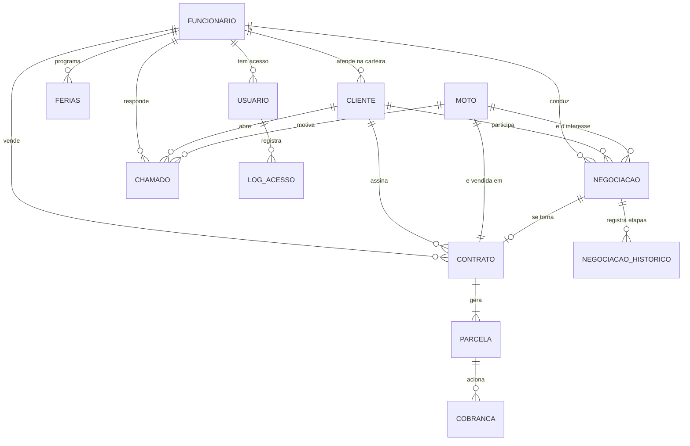

# Modelo de dados

Banco **SQLite**. A estrutura completa está em
[`banco/schema.sql`](../banco/schema.sql) e os dados de teste em
[`banco/seed.sql`](../banco/seed.sql).

---

## Diagrama



---

## As tabelas

| Tabela | Guarda | Requisito |
|---|---|---|
| `funcionario` | Equipe da loja, cargo, salário, percentual de comissão e meta | RF-06 |
| `ferias` | Períodos de férias programados e concluídos | RF-06 |
| `usuario` | Login, senha (scrypt) e perfil de acesso | RNFS-01 |
| `log_acesso` | Toda tentativa de login, com sucesso ou não | RNFS-01 |
| `cliente` | Dados do cliente e o vendedor dono da carteira | RF-01 |
| `moto` | Estoque: código, modelo, custo, preço e datas de entrada/saída | RF-03 |
| `negociacao` | A venda em andamento e sua etapa no funil | RF-01 |
| `negociacao_historico` | Cada mudança de etapa, com data e responsável | RF-01 |
| `contrato` | Venda fechada: condição, valor e situação | RF-04 |
| `parcela` | Boletos gerados do contrato | RF-04 |
| `cobranca` | Ações da régua já executadas | RF-05 |
| `chamado` | Chamados de pós-venda | RF-02 |
| `parametro` | Configurações que mudam sem alterar o programa | RNFR-07.3 |

---

## As visões — onde estão as regras

Quatro regras de negócio ficam em **visões SQL**, e não no programa. O
motivo é simples: assim o cálculo é sempre o mesmo, venha de onde vier a
consulta, e nunca fica desatualizado.

### `vw_estoque` — tempo de pátio
Calcula `dias_patio` pela diferença entre hoje e a data de entrada, e marca
`parada_90_dias`. Atende ao RNFR-03.1: nenhuma rotina precisa rodar de
madrugada para atualizar um campo.

### `vw_parcela` — situação real da parcela
A coluna `situacao` da tabela guarda apenas `aberta`, `paga` ou `cancelada`.
Quem diz que uma parcela está **vencida** é a visão, comparando o vencimento
com a data de hoje. Isso elimina a possibilidade de uma parcela vencida
continuar aparecendo como "em aberto".

### `vw_chamado` — chamado atrasado
Mesma ideia: passou de 5 dias sem movimentação e não está resolvido, é
atrasado (RNFR-02.1).

### `vw_comissao` — comissão do vendedor
Soma os contratos do vendedor por mês, mas só os que têm a primeira parcela
quitada (RNFR-07.1), e aplica o percentual do próprio vendedor (RNFR-07.3).

---

## Decisões que valem explicar na defesa

**Por que SQLite, e não MySQL ou PostgreSQL?**
Porque é um protótipo que precisa rodar em qualquer computador com dois
cliques, sem instalar servidor de banco. O SQL usado é padrão: migrar para
PostgreSQL na produção exige mudar pouca coisa (basicamente os tipos e as
funções de data).

**Por que as datas dos dados de teste são relativas?**
Todo o `seed.sql` usa `date('now', '-N days')` em vez de datas fixas. Assim
o protótipo nunca fica "velho": não importa em que dia o professor ou o
cliente abrir, sempre haverá motos paradas há 90 dias e parcelas vencidas.

**Por que a senha não está no `seed.sql`?**
O arquivo grava `'DEFINIR'` na coluna `senha_hash`, e o servidor gera o hash
scrypt na primeira execução. Assim nenhuma senha, nem de teste, fica escrita
em arquivo versionado no GitHub.

**Por que as parcelas do seed são geradas com SQL recursivo?**
Seriam mais de 350 linhas de `INSERT` escritas à mão. Um `WITH RECURSIVE`
gera todas a partir da quantidade de parcelas de cada contrato — e o mesmo
raciocínio está no `fecharVenda()`, quando uma venda nova é fechada.

---

## Consultas úteis para a apresentação

Para abrir o banco: qualquer visualizador de SQLite (DB Browser for SQLite,
por exemplo) apontando para `banco/marelo.db`.

```sql
-- Motos paradas há mais de 90 dias
SELECT codigo, modelo, dias_patio, preco_venda
  FROM vw_estoque
 WHERE parada_90_dias = 1
 ORDER BY dias_patio DESC;

-- Quem está devendo, e há quanto tempo
SELECT cliente_nome, COUNT(*) AS parcelas,
       ROUND(SUM(valor), 2) AS total, MAX(dias_atraso) AS pior_atraso
  FROM vw_parcela
 WHERE situacao_real = 'vencida'
 GROUP BY cliente_nome
 ORDER BY total DESC;

-- Comissão do mês
SELECT vendedor_nome, vendas, faturamento, comissao
  FROM vw_comissao
 WHERE competencia = strftime('%Y-%m', date('now'))
 ORDER BY comissao DESC;

-- Caminho completo de uma venda, do primeiro contato ao contrato
SELECT c.nome AS cliente, h.etapa_de, h.etapa_para, h.responsavel, h.momento
  FROM negociacao_historico h
  JOIN negociacao n ON n.id = h.negociacao_id
  JOIN cliente c ON c.id = n.cliente_id
 ORDER BY h.negociacao_id, h.momento;
```
